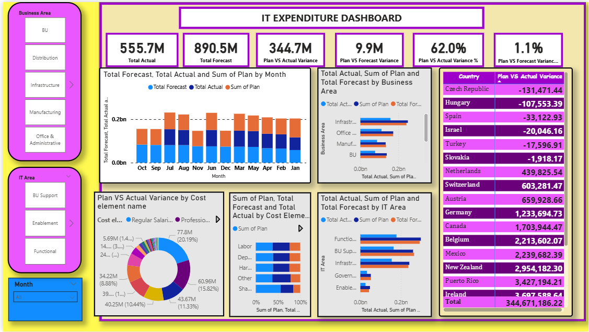

IT Expenditure Dashboard 📊  

  
  

📌 Project Overview  
The **IT Expenditure Dashboard** is an interactive Power BI report designed to analyze and visualize IT-related costs across departments, vendors, and time periods.  
This dashboard provides key insights into budget allocation, expenditure patterns, and cost optimization opportunities.  

🚀 Features  
- 📈 **Year-wise & Month-wise IT Expenditure Trends**  
- 🏢 **Department-wise Spending Distribution**  
- 🧾 **Vendor & Category Analysis**  
- 📊 **KPIs for Budget vs Actual Spending**  
- 🔍 **Interactive filters & slicers for custom insights**  

## 📂 File  
- `IT EXPENDITURE DASHBOARD FIN.pbix` → Power BI file containing the full dashboard  

🛠️ Tech Stack  
- **Tool:** Power BI  
- **Data Source:** (Replace with your dataset details, e.g., Excel/SQL/CSV)  
- **Techniques Used:** Data cleaning, DAX measures, KPIs, interactive visuals  

📷 Dashboard Preview  

  

📥 How to Use  
1. Clone this repository  
   ```bash
   git clone https://github.com/your-username/it-expenditure-dashboard.git

2. Open the `.pbix` file in **Power BI Desktop**
3. Update data source paths if required
4. Explore the visuals and interact with filters

📊 Insights Derived

* Identified departments with maximum IT spending
* Vendor-level cost comparisons
* Trend of IT expenditure over time
* Budget vs actual gap analysis

🔮 Future Scope

* Integration with live SQL/ERP databases
* Automated data refresh using Power BI Service
* Advanced predictive analytics for cost forecasting

🤝 Contributing

Contributions are welcome! Fork the repo, make your changes, and submit a pull request.

📧 Contact

For queries or collaboration, reach out:
**Bharath S** – [LinkedIn](https://linkedin.com) | [Email](mailto:your-email@example.com)
